<!-- Please do not change this logo with link -->

# Basic Bidirectional UART Communication using the PIC18F56Q71
## Overview
This project uses the MPLAB® Code Configurator (MCC) Melody graphical programming tool to configure the PIC18F56Q71 device populating a Curiosity Nano (Cnano) board to receive and output single ASCII characters over the integrated Serial/CDC port. When the switch on the Cnano board is pressed, a pin change interrupt is triggered and the ASCII character 'S' is transmitted over the Universal Asynchronous Receiver Transmitter (UART), converted to the USB protocol and then displayed in the MPLAB Data Visualizer terminal window. When the ASCII character 'T' is entered in the Data Visualizer terminal window, the value is transmitted over USB and then converted to the UART protocol. A UART Receive interrupt will then be triggered and the LED on the Cnano board will toggle ON/OFF. No other character will generate the interrupt.

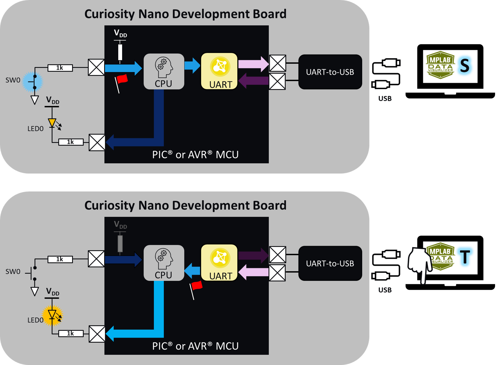

**Note:** The following project can be used as a reference for most PIC® devices, with some modifications. 

## Related Documentation
- [Get Started Now With PIC® Microcontrollers (MCUs)]() - Includes tool installation and other introductory resources

## Software Used
!!!
<ul>
<li> <a target="_blank" href="http://www.microchip.com/mplab/mplab-x-ide">MPLAB X IDE</a> v6.10 or newer
 </li>
 <li> <a target="_blank" href="http://www.microchip.com/mplab/xc8">MPLAB XC8 Compiler</a> v2.41 or newer

 </li>
</ul>

## Hardware Used
!!!
<ul>

<li> <a target="_blank" href="https://www.microchip.com/en-us/development-tool/EV01G21A">PIC18F56Q71 Curiosity Nano Evaluation Kit</a> for PIC MCU version
 </li>
</ul>

## References !!!Delete Section after updating Related Documentation!!!
<ul>
<li><a target="_blank" href="https://www.microchip.com/en-us/products/microcontrollers-and-microprocessors/8-bit-mcus/pic-mcus/get-started-now">Get Started Now With PIC® Microcontrollers (MCUs)</a> homepage includes tool installation and other introductory resources</li>
<li> <a target="_blank" href="https://www.microchip.com/en-us/product/PIC18F56Q71">PIC18F56Q71 Device Homepage</a> includes datasheet and other related documentation
 </li>
  <li> <a target="_blank" href="https://www.microchip.com/en-us/products/microcontrollers-and-microprocessors/8-bit-mcus/core-independent-and-analog-peripherals/communication-connectivity-peripherals/uart-peripherals"> Universal Asynchronous Receiver and Transmitter (UART) Peripheral Homepage </a> 
  includes additional reference documentation
 </li>
   <li> <a target="_blank" href="https://onlinedocs.microchip.com/oxy/GUID-420E6AAC-9141-47BF-A4C7-A6EA17246D0D-en-US-14/GUID-BC229F28-29AC-46A3-9FAA-1681C2E93A5C.html"> UART Driver MCC Melody API Reference for PIC16F/18F MCU Families </a> 
 
 </li>
</ul>

## Hardware Configuration using the MCC Melody

Create a new project inside of MPLAB X IDE and open MCC Melody by either clicking the icon at the top of the IDE or by selecting *Tools>Embedded>MPLAB Code Configurator v.x: Open/Close*.

Once inside of the MCC Melody plug-in, add an instance of the UART peripheral from the Device Resources: 

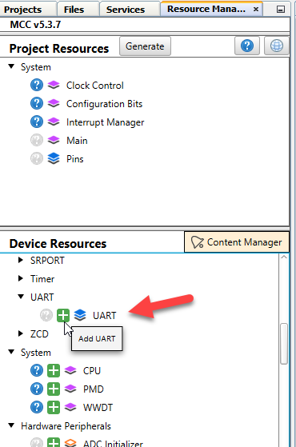

Once added, configure the UART as follows:

Next, configure the UART by selecting the UART(None) instance in either the **Project Resources** panel or the *Builder* tab to open the *Easy View* window.

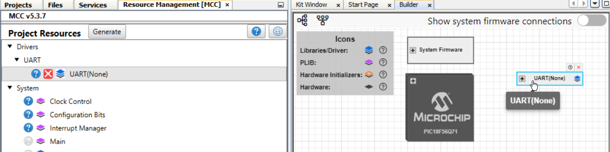

The PIC18F56Q71 populating the Cnano board features two UART peripherals. The correct UART must be selected as the hardware that converts the UART signal to and from USB connects to specific pins on the device. Determining which UART and pins to use can be found in the PIC18F56Q71 Cnano schematic. A link to the schematic is available in the *Kit Window* which should open whenever a Cnano board is connected to the computer and MPLAB X IDE is open or by selecting *Window>Kit Window* inside of the IDE. 

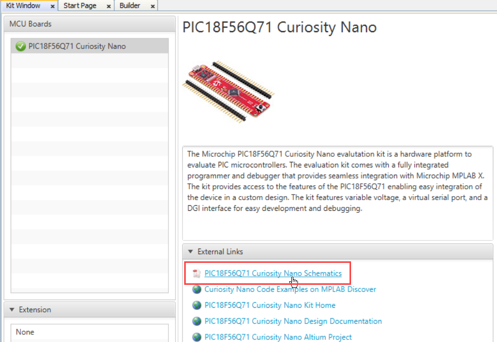

The first page of the schematic will feature a connection interface diagram including the UART and associated pins needed to interface with the integrated Serial/CDC port. In this instance, connect UART2 to pins RB4 for the transmit signal (TX) and RB5 for the receive signal (RX).

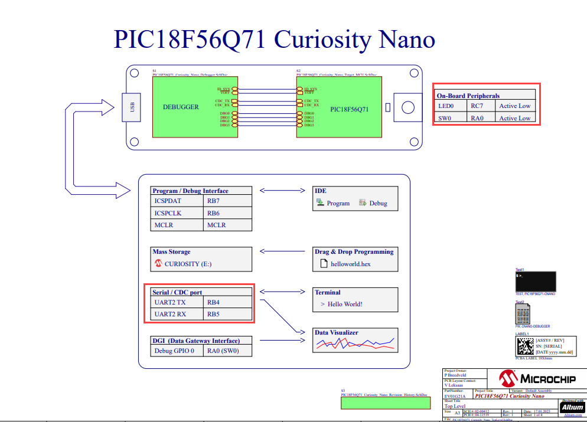

The integrated LED is connected to the pin RC7 and the switch is connected to pin RA0.

In *Easy View* select UART2 from the UART PLIB Selector.

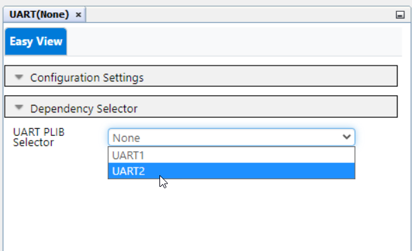

The image below presents how the *Builder* window will look:

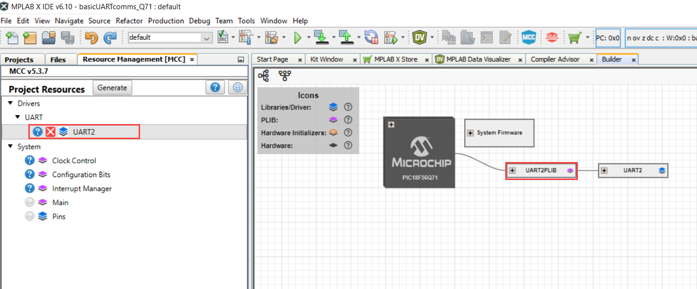

Select the UART2 driver either from the **Project Resources** panel or from the *Builder* window to open the *Easy View* settings in the **UART2** tab.

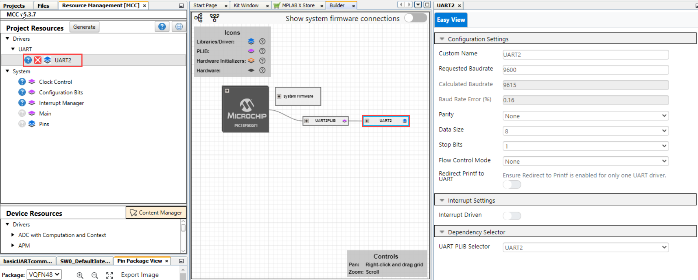

Inside *Easy View* enable interrupts in the Interrupt Settings section by toggling the Interrupt Driven slider to the ON position and leaving all other settings at their default:

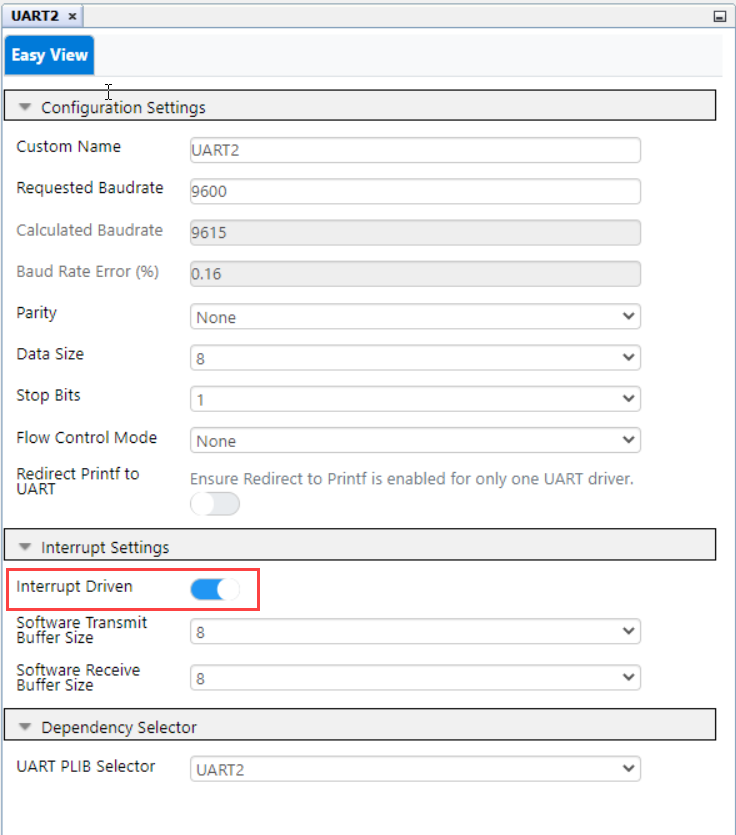

Select the *UART2PLIB* instance in the *Builder* window to open it's *Easy View* and ensure that both Receive and Transmit Interrupts have been enabled:

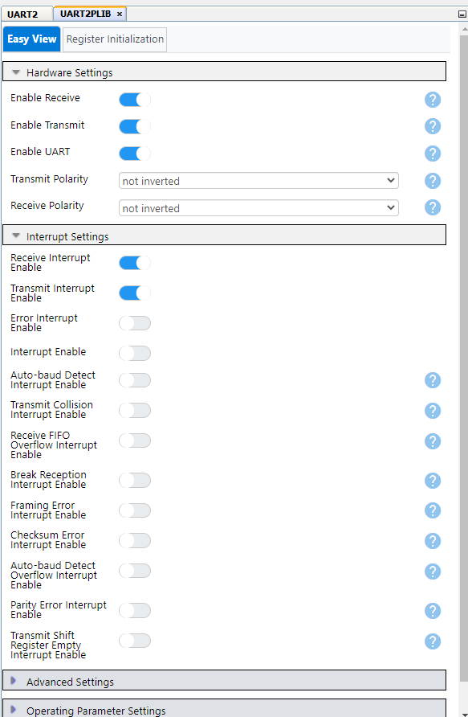

In the **Pin Grid View** pane at the bottom of the Melody interface, connect the UART2>RX2 signal to pin RB5 (package pin #17) and the UART2>TX2 signal to pin RB4 (package pin #16) by clicking the lock icon associated with them:

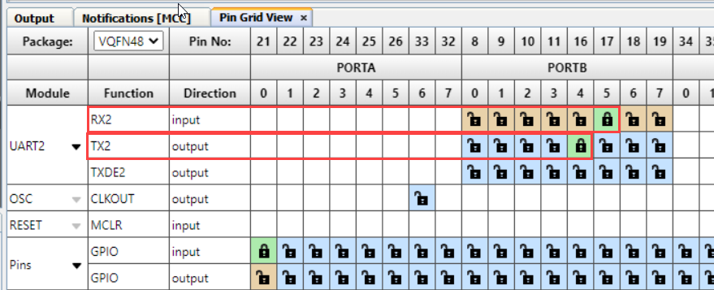

Next, configure the pins associated with the Curiosity Nano switch and LED. 

In the **Pin Grid View** pane, connect pin RA0 (package pin #21) that is connected to the switch (SW0) on the Curiosity Nano board as a GPIO input and pin RC7 (package pin #1) connected to the LED (LED0) as an output by clicking in the appropriate grid square for the associated signal:

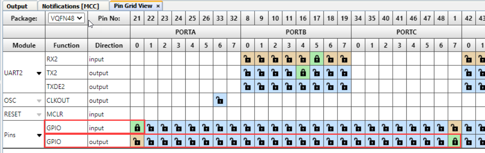

Go to *Project Resources>System>Pins* to open the associated *Easy View*.

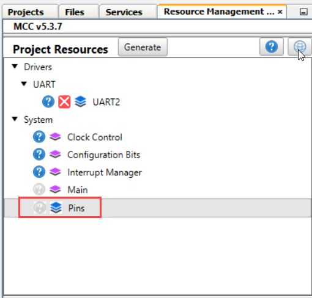

In the Custom Name column, rename pin RA0 to "SW0" and pin RC7 to "LED". This will make it easier to navigate and use the generated API. 

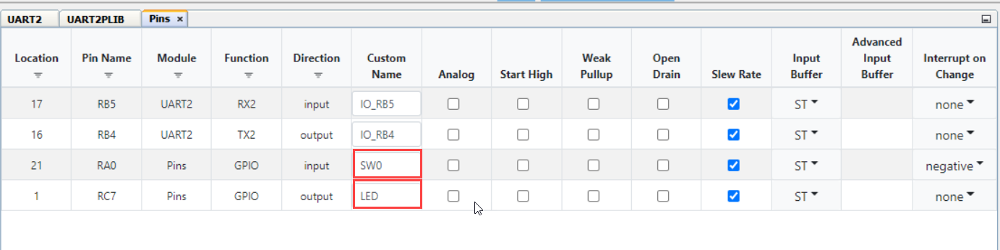

Note from the Curiosity Nano schematics that the SW0 is active LOW and connected directly to pin RA0 through a current limiting resistor. To eliminate unknown states, the switch pin will need to have a pull-up resistor. The PIC18F56Q71 device family features integrated Weak PullUps which can be enabled by checking the box for the associated pin in the Weak Pullup column of the *Easy View*:

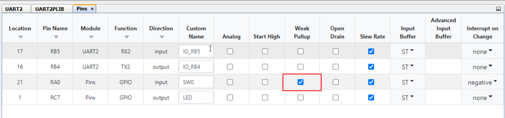

An Interrupt-on-Change (IoC) will be generated when the voltage on the pin associated with SW0 changes. Since the switch on the Curiosity Nano board is active LOW, this means that the switch resting state will be HIGH until pressed. Therefore, the Interrrupt on Change column setting for the SW0 pin is configured to trigger on the negative transition of the pin voltage using the drop-down menu:

Click the **Generate** button in the **Project Resources** to generate the API based on the above configurations:

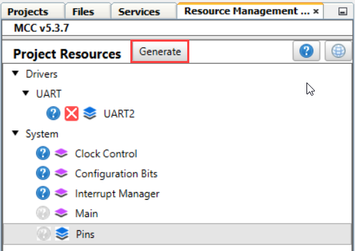

## Using Interrupts in Generated API

Navigate to the **Projects** tab in MPLAB X IDE. Locate the *uart2.c* source file by expanding the folders *basicUARTcomms_Q71>Source Files>MCC Generated Files>uart>uart.c*. Double click *uart.c* to open and do the following: 

Scroll down to `UART2_ReceiveISR()`. When the UART detects a received value on it's receive (RX) pin, an interrupt will be generated and this section of code will be executed:

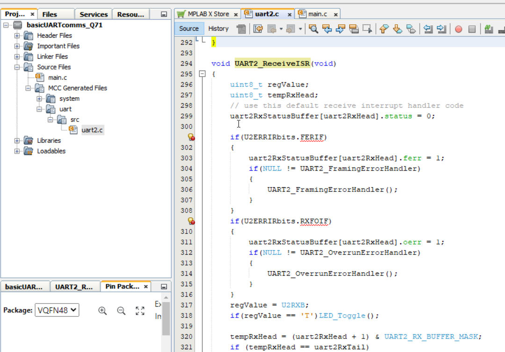

Inside of the Interrupt Service Routine (ISR), locate the section that reads the received value. This is done using the `regValue` variable to read the contents of the UART2 Receive Register (U2RXB). 

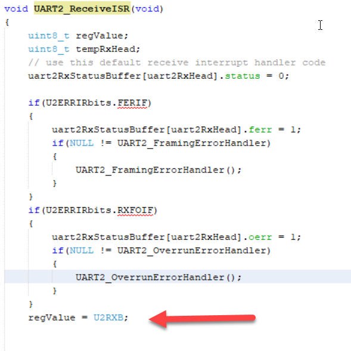

**Note:** Reading the U2RXB register clears the value inside of the register. 

This variable checks the value received. If it is the character "T", it toggles the LED ON/OFF, but if it isn't, nothing happens. To do this, use the `regValue` variable along a generated macro called `LED_Toggle()`, based on the unique name given to pin RC7 in the previous section,  inside of an `if` statement, as follows:

` if(regValue == 'T')LED_Toggle();`

Add the above code immediately below the `regValue = U2RXB;` in the receive ISR:

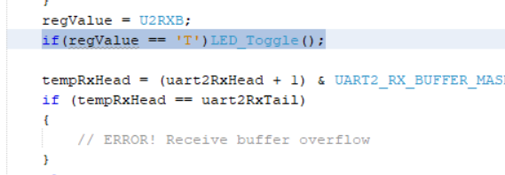

**Note:** The `LED_Toggle()` macro can be viewed in the *pins.h* header file located in *basicUARTcomms_Q71>Header Files>MCC Generated Files>system>pins.h*:

Next, configure the SW0 interrupt to transmit the character 'S' over the UART when pressed. Navigate to the *pins.c* file in *basicUARTcomms_Q71>Source Files>MCC Generated Files>system>src>pins.c*. Scroll through the file to locate the `SW0_DefaultInterruptHandler()` ISR named after the custom name added to pin RA0 in the previous section:

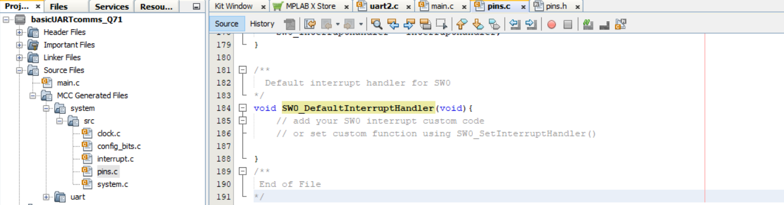

Inside of ISR, add the following code to transmit the character 'S' using the `UART2_Write()`  when the SW0 is pressed below the commented section:

`UART2_Write('S');`
 
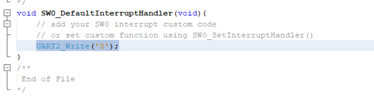

In order to use the `UART2_Write()`, the *uart2.h* file must be added. Scroll to the top of the *pins.c* source file and add the following code immediately below the `#include "../pins.h"` include:

`#include "../../uart/uart2.h"`

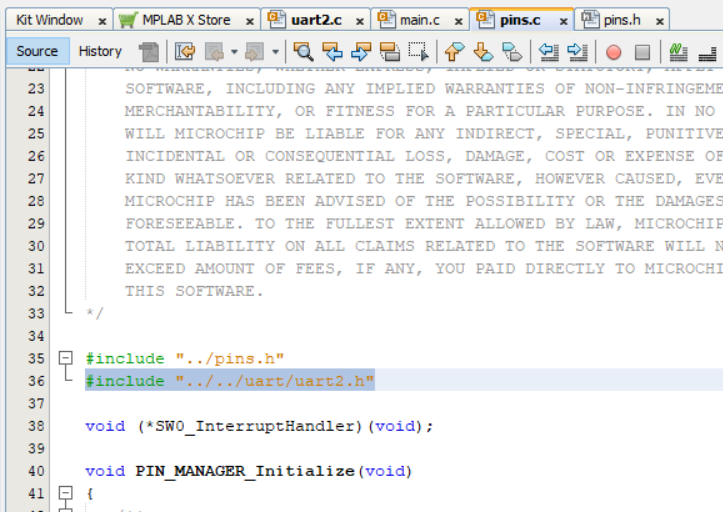

In order for any interrupt to be used on the PIC18F56Q71, global interrupts must be enabled. This is easily done by navigating to the *basicUARTcomms_Q71>Source Files>main.c* and scrolling to the `main()` function. At the top of the function, uncomment the  `//INTERRUPT_GlobalInterruptEnable();` macro by deleting the two forward slashes:

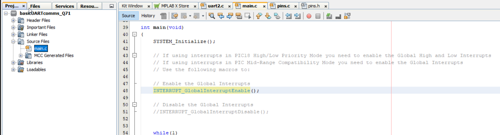

Finally, program the PIC18F56Q71 by hitting the **Make and Program Device Main Project** button at the top of the IDE:

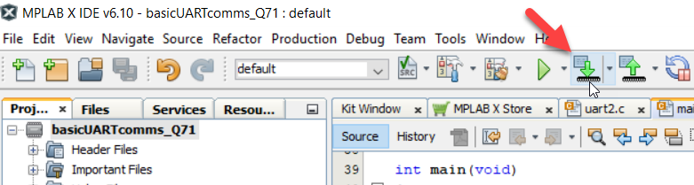

## Operation

The **Data Visualizer** MPLAB X IDE plugin will be used to verify operation of the project.

Click on the Data Visualizer plugin button at the top of the IDE to open:

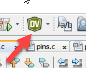

The PIC18F56Q71 Curiosity Nano board is recognized by the Data Visualizer, including the associated COM port. Note that your COM port number may differ than what is shown below. 

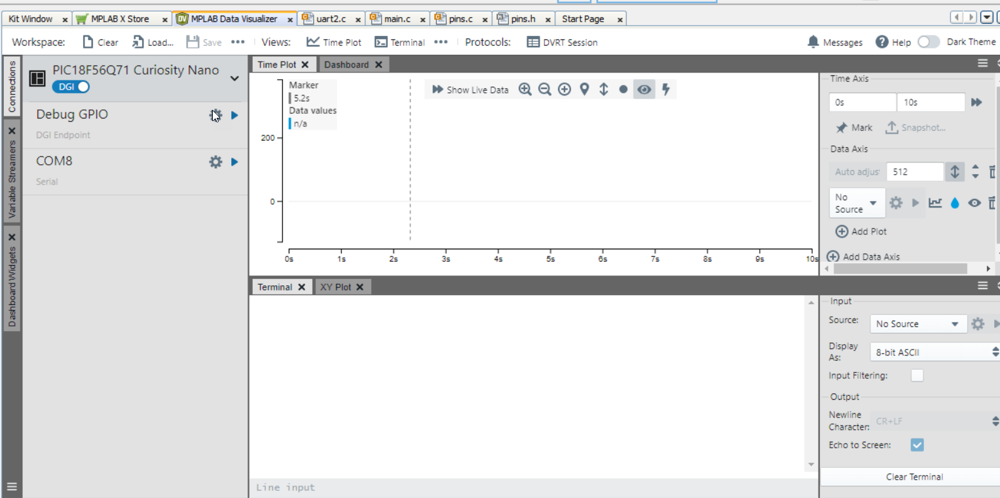

The terminal window will be the only one used, so the rest can be closed, as shown below. Begin communication between the COM port and terminal by hovering the COM port instance and selecting the **Display as text in the terminal** button:

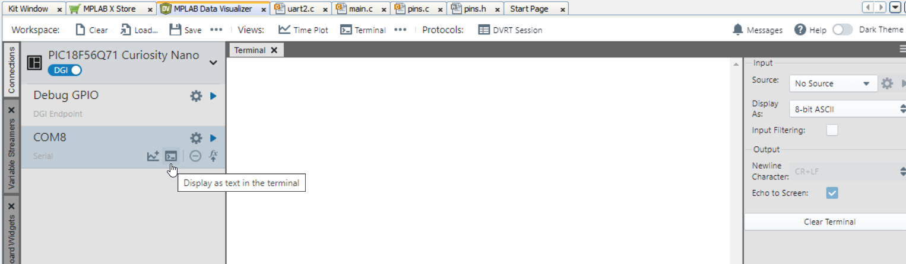

Verify that the UART2 receive interrupt is working by clicking inside of the terminal window and entering the character 'T'. This action will toggle the LED on the Curiosity Nano board ON/OFF. Entering any other character will have no effect.

Verify the SW0 Interrupt-on-Change by pressing the switch on the Curiosity Nano board. The character 'S' will be output to the terminal.

## Summary

This example demonstrates basic UART transmit and receive functionality using an PIC18F56Q71 microcontroller and MPLAB X with MCC Melody.
