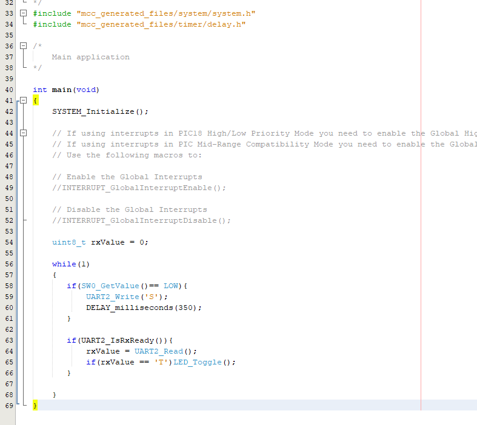

<!-- Please do not change this logo with link -->

# Basic Bidirectional UART Communication Using the PIC18F56Q71
## Overview
This project uses the MPLAB® Code Configurator (MCC) Melody graphical programming tool to configure the PIC18F56Q71 device populating a Curiosity Nano (Cnano) board to receive and output single ASCII characters over the integrated Serial/CDC port. When the switch on the Cnano board is pressed, the pin is driven LOW, firmware will then trigger the Universal Asynchronous Receiver Transmitter (UART) peripheral to transmit the ASCII character 'S' over the Universal Asynchronous Receiver Transmitter (UART) that is converted to the USB protocol using integrated hardware on the Cnano so that it can then be displayed in the MPLAB Data Visualizer terminal window within the MPLAB® X IDE. When the ASCII character 'T' is entered in the Data Visualizer terminal window, the value is transmitted over USB and then converted to the UART protocol. A UART receive flag will trigger firmware to check the value, if it is an 'T' the 'LED' on the Cnano board will toggle ON/OFF.

**Note:** The following project can be used as a reference for most PIC® devices, with some modifications.

## Related Documentation
- [Get Started Now With PIC® Microcontrollers (MCUs)](https://www.microchip.com/en-us/products/microcontrollers-and-microprocessors/8-bit-mcus/pic-mcus/get-started-now?utm_source=GitHub&utm_medium=TextLink&utm_campaign=MCU8_MMTCha_pic18q71&utm_content=pic18f56q71-basic-uart-comms-mplab-mcc-github&utm_bu=MCU08) - Includes tool installation and other introductory resources
- [PIC18F56Q71 Device Homepage](https://www.microchip.com/en-us/product/PIC18F56Q71?utm_source=GitHub&utm_medium=TextLink&utm_campaign=MCU8_MMTCha_&utm_content=pic18f56q71-basic-uart-comms-mplab-mcc-github&utm_bu=MCU08) - Includes data sheet and other related documentation
- [Universal Asynchronous Receiver and Transmitter (UART) Peripheral Homepage](https://www.microchip.com/en-us/products/microcontrollers-and-microprocessors/8-bit-mcus/core-independent-and-analog-peripherals/communication-connectivity-peripherals/uart-peripherals?utm_source=GitHub&utm_medium=TextLink&utm_campaign=MCU8_MMTCha_pic18q71&utm_content=pic18f56q71-basic-uart-comms-mplab-mcc-github&utm_bu=MCU08) - Includes additional reference documentation
- [MCC Melody API Reference for PIC MCU Families](https://onlinedocs.microchip.com/v2/keyword-lookup?keyword=SCF-PIC8-UART&version=latest&redirect=true)

## Software Used

- [MPLAB® X IDE 6.2.0](https://www.microchip.com/en-us/tools-resources/develop/mplab-x-ide?utm_source=GitHub&utm_medium=TextLink&utm_campaign=MCU8_MMTCha_pic18q71&utm_content=pic18f56q71-basic-uart-comms-mplab-mcc-github&utm_bu=MCU08) or newer
- [MPLAB® XC8 2.46.0](https://www.microchip.com/en-us/tools-resources/develop/mplab-xc-compilers?utm_source=GitHub&utm_medium=TextLink&utm_campaign=MCU8_MMTCha_pic18q71&utm_content=pic18f56q71-basic-uart-comms-mplab-mcc-github&utm_bu=MCU08) or newer

## Hardware Used

- [PIC18F56Q71 Curiosity Nano Evaluation Kit](https://www.microchip.com/en-us/development-tool/EV01G21A?utm_source=GitHub&utm_medium=TextLink&utm_campaign=MCU8_MMTCha_pic18q71&utm_content=pic18f56q71-basic-uart-comms-mplab-mcc-github&utm_bu=MCU08)

## Hardware Configuration using the MCC Melody

Create a new project inside of MPLAB X IDE and open MCC Melody by either clicking the icon at the top of the IDE or by selecting *Tools>Embedded>MPLAB Code Configurator v.x: Open/Close*.

Once inside of the MCC Melody plug-in, add an instance of the UART peripheral from the **Device Resources** tab:

Once added, configure the UART as follows:

Next, configure the UART by selecting the UART(None) instance in either the **Project Resources** panel or the **Builder** tab to open the **Easy View** window.

The PIC18F56Q71 populating the Cnano board features two UART peripherals. The correct UART must be selected as the hardware that converts the UART signal to and from USB connectors to specific pins on the device. Determining which UART and pins to use can be found in the PIC18F56Q71 Cnano schematic. A link to the schematic is available in the **Kit Window** which opens whenever a Cnano board is connected to the computer and MPLAB X IDE is open or by selecting *Window>Kit Window* inside of the IDE.

The first page of the schematic will feature a connection interface diagram including the UART and associated pins needed to interface with the integrated Serial/CDC port. In this instance, connect UART2 to pins RB4 for the transmit signal (TX) and RB5 for the receive signal (RX).

The integrated 'LED' is connected to the pin RC7 and the switch is connected to pin RA0.

In  **Easy View**  select UART2 from the UART PLIB Selector.

The image below presents the **Builder** tab:

Clicking on the UART2 Library/Driver block to open the associated Easy View. Inside of the Easy View, edit the **Requested Baudrate** value ensuring that it is 9600.

All other configuration parameters can be left at their default.

In the **Pin Grid View** tab at the bottom of the Melody interface, connect the UART2>RX2 signal to pin RB5 (package pin #17) and the UART2>TX2 signal to pin RB4 (package pin #16) by clicking the lock icon associated with them:

Next, configure the pins associated with the Curiosity Nano switch and LED.

In the **Pin Grid View** tab, connect pin RA0 (package pin #21) that is connected to the switch (SW0) on the Curiosity Nano board as a General Purpose Input/Output (GPIO) input and pin RC7 (package pin #1) connected to the 'LED' (LED0) as an output by clicking the appropriate grid square for the associated signal:

Go to *Project Resources>System>Pins* to open the associated  **Easy View** .

In the Custom Name column, rename pin RA0 to 'SW0' and pin RC7 to 'LED'. This will make it easier to navigate and use the generated API.

Note from the Curiosity Nano schematics that the 'SW0' is active LOW and connected directly to pin RA0 through a current limiting resistor. To eliminate unknown states, the switch pin will need to have a pull-up resistor. The PIC18F56Q71 device family features integrated Weak Pullups which can be enabled by checking the box for the associated pin in the Weak Pullup column of the  **Easy View** :

Finally, a delay is implemented in this project using the DELAY Library. Add an Delay instance from the Device Resources from the Timer menu.

The MCC Melody project should now resemble the image below:

  

Click the **Generate** button in **Project Resources** to generate the API based on the above configurations:

## Using the Generated API

Navigate to the **Projects** tab in MPLAB X IDE. Locate the `main.c` source file by expanding the folders *basicUARTcomms_Q71>Source Files>main.c*. Double click `main.c` to open and do the following:

Scroll down to `main()`.

Wen the switch is pressed, according to the Cnano schematics, the siganl on the SW0 (formerly RA0) pin will be driven LOW. When this occurs, the UART will be triggered to transmit an 'S' ASCII character over it's TX line.

To check the pin, add an `if` statement that will use the `SW0_GetValue()` which return the current pin state. If that value is LOW, then execute code to transmit 'S' character by adding that as an argument to the `UART2_Write('S')` macro. A 350 ms delay is next added using the `DELAY_milliseconds(350)` macro to allow the user to release the switch before the next pin check has a chance to occur.

An API generated macro or function can be added by starting with typing the peripheral and then on a Windows machine using the CTRL+space feature to pull up a list of available libraries and double clicking on the one to add.

The user then need only add the parameters required, in this case the 'S', and ensuring that the semicolon is added at the end of the line of code. In addition, when adding the `SW0_GetValue` macro the `()` will need to be added by the user.

Next, a second `if` statement is used to check if a character has been received over the UART using the `UART2_IsRxReady()` macro. If TRUE an 8-bit variable `rxValue` initialized prior to the `while(1)` loop is loaded with the received value using the `UART2_Read()`. This value is then checked using a final `if` statement for the 'T' ASCII character. If this condition is TRUE, the voltage level of the pin connected to the LED (RC7) is toggle HIGH or LOW (depending on previous state) using the `LED_Toggle()` macro.

The final code should resemble the image below:

## Program the Cnano Board and Configure the Data Visualizer Plugin

Program the PIC18F56Q71 by hitting the **Make and Program Device Main Project** button at the top of the IDE:

The Data Visualizer MPLAB X IDE plug-in will be used to verify operation of the project.

Click the Data Visualizer plugin button at the top of the IDE to open:

The PIC18F56Q71 Curiosity Nano board is recognized by the Data Visualizer, including the associated COM port. Note that the COM port number may differ than what is shown below.

The terminal window will be the only one used, so the rest can be closed, as shown below. Begin communication between the COM port and terminal by hovering the COM port instance and selecting the **Display as text in the terminal** button:

## Operation

Verify the 'SW0' pin level code by pressing the switch on the Curiosity Nano board. The character 'S' will be output to the terminal.

Verify UART receive firware is working by clicking inside of the terminal window and entering the character 'T'. This action will toggle the 'LED' on the Curiosity Nano board ON/OFF. Entering any other character will have no effect.

## Summary

This example demonstrates basic UART transmit and receive functionality using an PIC18F56Q71 microcontroller and MPLAB X with MCC Melody.
